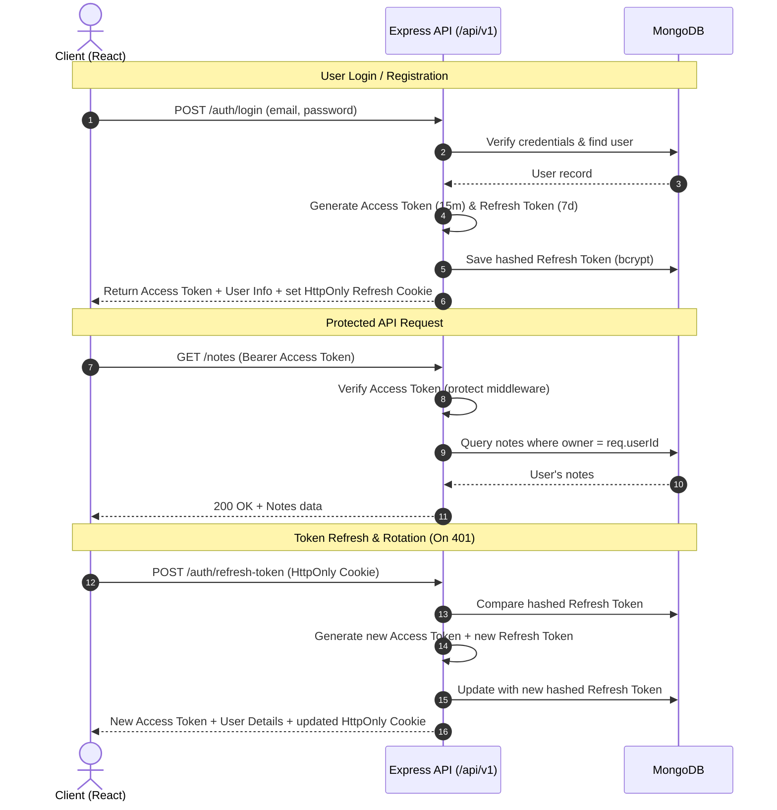

# NoteNest 📝

NoteNest is a modern, responsive, full-stack note-taking application built with the **MERN stack** (MongoDB, Express, React 19, Node.js). Engineered with clean architecture and security best practices, it features a sleek dark-mode React frontend powered by Tailwind CSS v4 and React Context, and a robust Express REST API with bcrypt-hashed refresh token rotation, JWT authentication, and user-scoped data isolation.

---

## 🚀 Key Features

- **🔐 Dual-Token Authentication with Rotation:** Short-lived JWT Access Tokens (15m) paired with HttpOnly, SameSite Refresh Token cookies (7d). User profile data is automatically synchronized upon token refresh.
- **🛡️ Refresh Token Hashing & Rotation:** Refresh tokens are hashed with `bcryptjs` before storage in MongoDB, and rotated upon every refresh request to mitigate replay attacks.
- **👤 User-Scoped Data Privacy:** Notes are strictly bound to their creator (`owner: ObjectId -> User`). Users can only query, create, edit, and delete their own notes.
- **⚡ Reactive Global State:** Context API (`AuthContext`, `NoteContext`) provides clean, lightweight state management without external store overhead.
- **🔄 Auto Token Interceptors:** Axios request interceptor attaches bearer tokens dynamically, while response interceptors automatically intercept 401s, perform silent background refreshes, and transparently replay failed requests.
- **🛡️ Comprehensive Route Guards:**
  - `ProtectedRoute`: Blocks unauthorized access to notes and dashboard views.
  - `PublicRoute`: Redirects already-authenticated users away from login and registration pages.
  - `NotFound`: Dedicated 404 page for unmatched routes.
- **⚠️ Interactive Confirmation Dialogs:** Modal confirmation dialogs with keyboard accessibility (Escape key support) for irreversible actions like deleting a note or logging out.
- **🍞 Rich Toast Notifications:** Integrated [Sonner](https://sonner.emilkowal.ski/) for crisp, non-blocking feedback across auth, creation, update, and deletion events.
- **👁️ Password Visibility Toggles:** Interactive eye toggle to view or hide passwords on login and registration forms.
- **📱 Fully Responsive Dark UI:** Mobile-first layout with collapsible navigation drawer, mobile floating action button (FAB) for quick note creation, and smooth transitions.
- **🌐 Reverse Proxy & Multi-Origin CORS:** Vercel SPA rewrite rules proxying `/api/v1` to the Render backend for seamless production deployment without cross-site cookie issues; backend supports comma-separated `FRONTEND_URL` origins.
- **🩺 API Health Check:** Dedicated `/api/v1/health` endpoint for uptime monitoring.

---

## 🛠️ Tech Stack

### Frontend
- **Framework:** React 19
- **Routing:** React Router DOM v7
- **Styling:** Tailwind CSS v4 (native Vite integration)
- **HTTP Client:** Axios (custom instance with automatic request/response token refresh interceptors)
- **Notifications:** Sonner
- **Icons:** Lucide React
- **Build Tool:** Vite v8
- **Linter:** Oxlint
- **Hosting / Deployment:** Vercel

### Backend
- **Runtime:** Node.js (`>=20`)
- **Framework:** Express.js (v5)
- **Database / ODM:** MongoDB & Mongoose
- **Authentication & Security:** JSON Web Tokens (`jsonwebtoken`), Password & Token Hashing (`bcryptjs`), Cookie Parser (`cookie-parser`), CORS (multi-origin support)
- **Dev Tooling:** Nodemon
- **Environment:** Dotenv
- **Hosting / Deployment:** Render

---

## 📐 System Architecture

### Authentication & Token Rotation Flow



---

## 📡 API Reference

### 🩺 System Endpoints

| Method | Endpoint | Description | Auth Required |
| :--- | :--- | :--- | :--- |
| **GET** | `/api/v1/health` | Service uptime and health check | No |

---

### 🔐 Auth Endpoints (`/api/v1/auth`)

| Method | Endpoint | Description | Request Body | Response |
| :--- | :--- | :--- | :--- | :--- |
| **POST** | `/register` | Register a new account | `{ "name": "...", "email": "...", "password": "..." }` | `{ success, message, accessToken, user: { id, name, email } }` + HttpOnly cookie |
| **POST** | `/login` | Authenticate user & issue tokens | `{ "email": "...", "password": "..." }` | `{ success, message, accessToken, user: { id, name, email } }` + HttpOnly cookie |
| **POST** | `/refresh-token` | Rotate tokens & issue new access token | *HttpOnly Cookie* | `{ success, message, accessToken, user: { id, name, email } }` + new HttpOnly cookie |
| **POST** | `/logout` | Clear DB refresh token & cookie | *HttpOnly Cookie* | `{ success, message: "User logged out successfully" }` |

---

### 📝 Notes Endpoints (`/api/v1/notes`) — *Protected & User-Scoped*

> 🔒 **Header Required:** `Authorization: Bearer <accessToken>`

| Method | Endpoint | Description | Request Body | Response |
| :--- | :--- | :--- | :--- | :--- |
| **GET** | `/` | Retrieve all notes owned by authenticated user | *None* | `{ success, notes: [...] }` |
| **POST** | `/` | Create a new note bound to authenticated user | `{ "title": "String", "content": "String" }` | `{ success, note: { ... } }` |
| **PUT** | `/:id` | Update an existing note by ID (owner only) | `{ "title": "String", "content": "String" }` | `{ success, note: { ... } }` |
| **DELETE** | `/:id` | Delete a note by ID (owner only) | *None* | `{ success, message: "Note deleted successfully" }` |

---

## 📂 Project Structure

```text
NoteNest/
├── backend/
│   ├── src/
│   │   ├── config/             # Database connection setup (Mongoose)
│   │   │   └── db.js
│   │   ├── controllers/        # Business logic handlers
│   │   │   ├── auth.controller.js
│   │   │   └── note.controller.js
│   │   ├── middlewares/        # Express middlewares (JWT Auth protection)
│   │   │   └── auth.middleware.js
│   │   ├── models/             # Mongoose schemas (User with token hash & Note with owner ref)
│   │   │   ├── note.model.js
│   │   │   └── user.model.js
│   │   ├── routes/             # RESTful route definitions
│   │   │   ├── auth.route.js
│   │   │   └── note.route.js
│   │   ├── utils/              # Token generation, bcrypt hashing & cookie helpers
│   │   │   ├── cookieOptions.js
│   │   │   ├── hashToken.js
│   │   │   └── token.js
│   │   └── app.js              # Express app, middleware pipeline & route mounts
│   ├── server.js               # Async server bootstrap & DB listener
│   ├── package.json
│   ├── .env.example
│   └── .env
│
└── frontend/
    ├── src/
    │   ├── api/                # Axios instance with request/response auto-refresh interceptors
    │   │   └── url.js
    │   ├── components/         # Reusable UI components
    │   │   ├── ConfirmDialog.jsx   # Generic confirmation modal (logout, delete)
    │   │   ├── Footer.jsx
    │   │   ├── Navbar.jsx          # Responsive header with mobile drawer
    │   │   ├── NoteCard.jsx        # Note item with inline edit & delete confirmation
    │   │   ├── NoteForm.jsx        # Note creation form
    │   │   ├── ProtectedRoute.jsx  # Route guard for authenticated users
    │   │   └── PublicRoute.jsx     # Route guard redirecting logged-in users away from auth pages
    │   ├── context/            # React Context providers
    │   │   ├── AuthContext.jsx     # Session & auth state management
    │   │   └── NoteContext.jsx     # Notes CRUD state management
    │   ├── pages/              # Application views & pages
    │   │   ├── Createnote.jsx
    │   │   ├── Home.jsx
    │   │   ├── Login.jsx
    │   │   ├── NotFound.jsx        # 404 Not Found fallback
    │   │   └── Register.jsx
    │   ├── index.css           # Global stylesheet & Tailwind CSS v4 imports
    │   ├── Layout.jsx          # App shell wrapper (Navbar, Main, Footer, session spinner)
    │   └── main.jsx            # Application entry, router & Sonner Toaster provider
    ├── index.html
    ├── vite.config.js
    ├── vercel.json             # Vercel deployment config (SPA rewrites & API reverse proxy)
    ├── .env
    └── package.json
```

---

## ⚙️ Getting Started

### Prerequisites
- **Node.js** (`v20.x` or higher recommended)
- **npm** (`v10.x` or higher)
- **MongoDB** (Local instance or MongoDB Atlas cloud cluster)

---

### Step 1: Clone the Repository

```bash
git clone https://github.com/yourusername/NoteNest.git
cd NoteNest
```

---

### Step 2: Configure Environment Variables

#### Backend (`backend/.env`):
```env
PORT=4001
MONGO_URI=mongodb+srv://<username>:<password>@cluster0.example.mongodb.net/notenest
FRONTEND_URL=http://localhost:5173,https://your-production-app.vercel.app
JWT_ACCESS_SECRET=your_super_secret_access_key
JWT_REFRESH_SECRET=your_super_secret_refresh_key
NODE_ENV=development
```

#### Frontend (`frontend/.env`):
```env
# In development (direct to backend or proxy):
VITE_API_URL=http://localhost:4001/api/v1

# In production (using Vercel reverse proxy rewrite to backend):
# VITE_API_URL=/api/v1
```

---

### Step 3: Install & Run

#### 1. Start the Backend API:
```bash
cd backend
npm install
npm run dev
```
*Backend runs on `http://localhost:4001`.*

#### 2. Start the Frontend Application:
```bash
cd ../frontend
npm install
npm run dev
```
*Frontend runs on `http://localhost:5173`.*

---

## 🔒 Security & Architecture Highlights

1. **Hashed Refresh Token Rotation:** Refresh tokens stored in the database are hashed with `bcryptjs`. During each `/refresh-token` invocation, the old token is invalidated and a newly generated pair is issued.
2. **Environment-Aware Cookies:** Refresh tokens are delivered via `httpOnly` cookies with `secure: true` and `sameSite: "none"` in production, defending against Cross-Site Scripting (XSS) and CSRF attacks.
3. **User Isolation Enforcement:** Every note creation, retrieval, modification, or deletion query strictly verifies `owner: req.userId`, preventing unauthorized cross-user access.
4. **Resilient Interceptor Pipeline:** The frontend Axios client intercepts expired access tokens, requests a silent background refresh, and transparently retries original requests without disrupting the user session.
5. **Route Boundary Protection:** Both private routes (notes, dashboard) and guest-only routes (login, register) are cleanly guarded with redirection patterns.
6. **Clean Separation of Concerns:** Business logic, route handlers, middleware guards, and database schemas are completely decoupled across modular directories.

---

## 📄 License

This project is licensed under the **ISC License**.
