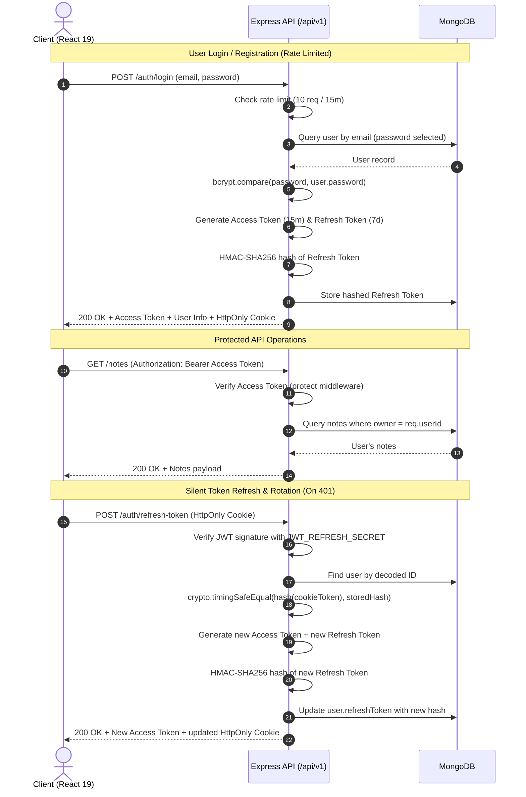

# NoteNest 📝

NoteNest is a modern, responsive, full-stack note-taking web application built with the **MERN stack** (MongoDB, Express 5, React 19, Node.js). Designed with a clean, distraction-free aesthetic, it pairs a fast Vite-powered React frontend utilizing Tailwind CSS v4 and React Context with an Express REST API featuring HMAC-SHA256 hashed refresh token rotation, JWT authentication, user-scoped data isolation, rate limiting, and HTTP security hardening.

---

## 🚀 Key Features

- **✨ Minimalist & Distraction-Free UI:** Clean, human-crafted design with responsive typography, dark-theme palette, and tactile card interactions designed for quick, effortless note-taking.
- **🔐 Dual-Token Authentication with Silent Refresh:** Short-lived JWT Access Tokens (15m) stored in memory paired with HttpOnly, SameSite Refresh Token cookies (7d) for secure, seamless session persistence.
- **🛡️ HMAC-SHA256 Token Hashing & Rotation:** Refresh tokens are hashed using HMAC-SHA256 prior to database storage and validated using `crypto.timingSafeEqual` to prevent timing attacks. Every refresh request rotates tokens to mitigate replay vulnerabilities.
- **👤 User-Scoped Data Isolation:** Notes are strictly bound to their creator via MongoDB references (`owner: ObjectId -> User`). All query, creation, update, and deletion operations enforce ownership verification on the server.
- **⚡ Reactive Global State:** React Context API (`AuthContext`, `NoteContext`) provides clean, lightweight state management for user sessions and notes CRUD operations without external state library overhead.
- **🔄 Resilient Axios Interceptors:** Axios client automatically attaches Bearer tokens to outgoing requests, intercepts 401 Unauthorized responses, performs silent background token refreshes, and transparently replays original requests.
- **⚡ Route-Level Code Splitting:** Pages are lazily loaded via `React.lazy()` and wrapped in `<Suspense>` with a unified `LoadingSpinner`, keeping initial JavaScript bundle sizes small.
- **🚀 Instant Session Hinting:** Local storage session hint (`notenest_has_session`) eliminates layout shifts and page flicker on initial app load before network validation completes.
- **🛡️ Strict Route Guarding:**
  - `ProtectedRoute`: Prevents unauthorized access to notes dashboard and creation pages.
  - `PublicRoute`: Redirects authenticated users away from guest pages (login, register).
  - `RootRoute`: Routes authenticated users directly to their notes workspace while presenting guests with the landing page.
  - `NotFound`: Dedicated 404 page for unmatched routes.
- **🔒 API Defense & Hardening:**
  - **Rate Limiting:** `express-rate-limit` enforces a strict 10-request window (per 15 min) across authentication endpoints (`/register`, `/login`, `/refresh-token`).
  - **Security Headers:** `helmet` sets hardened HTTP headers.
  - **Payload Size Capping:** Express JSON parser strictly capped at `50kb` to mitigate payload DoS.
  - **Gzip Compression:** `compression` middleware optimizes throughput and response payload sizes.
- **⚠️ Interactive Confirmation Dialogs:** Accessible modal confirmation dialogs with keyboard support (Escape key) for destructive actions (note deletion and logout).
- **🍞 Streamlined Toast Notifications:** Integrated [Sonner](https://sonner.emilkowal.ski/) for non-blocking user feedback, automatically dismissed on tab switch (`visibilitychange`) or page restoration (`pageshow`).
- **👁️ Password Visibility Toggles:** Convenient eye toggles to inspect password inputs during authentication.
- **📏 Character Limit Trackers:** Visual indicators enforce and display character bounds (100 for title, 10,000 for content) across note creation and editing interfaces.
- **🌐 Reverse Proxy Architecture:** Vite development proxy and Vercel production rewrites route `/api/v1` seamlessly to the Express API, eliminating third-party cookie restrictions.
- **🩺 API Health Monitoring:** Dedicated `/api/v1/health` endpoint for uptime checks.

---

## 🛠️ Tech Stack

### Frontend
- **Framework:** React 19 (`v19.2.7`)
- **Routing:** React Router DOM v7 (`v7.18.1`) with route-level lazy loading
- **Build Tool:** Vite 8 (`v8.1.1`)
- **Styling:** Tailwind CSS v4 (`v4.3.2`) with `@tailwindcss/vite`
- **Typography:** Plus Jakarta Sans (`@fontsource/plus-jakarta-sans`)
- **HTTP Client:** Axios (`v1.18.1`) with request/response interceptors
- **Notifications:** Sonner (`v2.0.8`)
- **Icons:** Lucide React (`v1.23.0`)
- **Linter:** Oxlint (`v1.71.0`)
- **Deployment:** Vercel

### Backend
- **Runtime:** Node.js (`>=20`)
- **Framework:** Express.js 5 (`v5.2.1`)
- **Database & ODM:** MongoDB with Mongoose (`v9.7.4`)
- **Security & Hardening:**
  - `helmet` (v8.3.0) — HTTP security headers
  - `compression` (v1.8.1) — Gzip response compression
  - `express-rate-limit` (v8.7.0) — IP-based rate limiting on sensitive routes
  - `bcryptjs` (v3.0.3) — Password hashing (10 salt rounds)
  - `crypto` (Node.js built-in) — HMAC-SHA256 token hashing with timing-safe comparison
  - `jsonwebtoken` (v9.0.3) — JWT issuance and verification
  - `cookie-parser` (v1.4.7) — HttpOnly cookie handling
  - `cors` (v2.8.6) — Configurable multi-origin support
- **Dev Tooling:** Nodemon (`v3.1.14`)
- **Deployment:** Render

---

## 📐 System Architecture

### Authentication & Token Rotation Flow



---

## 📡 API Reference

Base URL: `/api/v1`

### 🩺 System Endpoints

| Method | Endpoint | Description | Auth Required | Rate Limited |
| :--- | :--- | :--- | :--- | :--- |
| **GET** | `/health` | Service uptime and status check | No | No |

### 🔐 Authentication Endpoints (`/api/v1/auth`)

| Method | Endpoint | Description | Request Body | Response Payload | Rate Limited |
| :--- | :--- | :--- | :--- | :--- | :--- |
| **POST** | `/register` | Register a new user account | `{ "name": "...", "email": "...", "password": "..." }` | `{ "success": true, "message": "...", "accessToken": "...", "user": { "id": "...", "name": "...", "email": "..." } }` + HttpOnly Cookie | Yes (10 / 15m) |
| **POST** | `/login` | Authenticate user credentials | `{ "email": "...", "password": "..." }` | `{ "success": true, "message": "...", "accessToken": "...", "user": { "id": "...", "name": "...", "email": "..." } }` + HttpOnly Cookie | Yes (10 / 15m) |
| **POST** | `/refresh-token` | Rotate refresh token & issue new access token | *None (HttpOnly Cookie)* | `{ "success": true, "message": "...", "accessToken": "...", "user": { "id": "...", "name": "...", "email": "..." } }` + new HttpOnly Cookie | Yes (10 / 15m) |
| **POST** | `/logout` | Invalidate stored token & clear cookie | *None (HttpOnly Cookie)* | `{ "success": true, "message": "User logged out successfully" }` | No |

### 📝 Notes Endpoints (`/api/v1/notes`) — *Protected & User-Scoped*

> 🔒 **Header Required:** `Authorization: Bearer <accessToken>`

| Method | Endpoint | Description | Request Body | Response Payload |
| :--- | :--- | :--- | :--- | :--- |
| **GET** | `/` | Fetch all notes owned by the authenticated user (sorted by `createdAt: -1`) | *None* | `{ "success": true, "notes": [ { "_id": "...", "title": "...", "content": "...", "owner": "...", "createdAt": "...", "updatedAt": "..." } ] }` |
| **POST** | `/` | Create a new note bound to the authenticated user | `{ "title": "...", "content": "..." }` | `{ "success": true, "message": "Note created successfully", "note": { ... } }` |
| **PUT** | `/:id` | Update an existing note by ID (owner only) | `{ "title": "...", "content": "..." }` | `{ "success": true, "message": "Note updated successfully", "note": { ... } }` |
| **DELETE** | `/:id` | Permanently delete a note by ID (owner only) | *None* | `{ "success": true, "message": "Note deleted successfully" }` |

---

## 📂 Project Structure

```text
NoteNest/
├── backend/
│   ├── src/
│   │   ├── config/
│   │   │   └── db.js                   # Mongoose database connection setup
│   │   ├── controllers/
│   │   │   ├── auth.controller.js      # Register, login, refresh, logout logic
│   │   │   └── note.controller.js      # User-scoped notes CRUD operations
│   │   ├── middlewares/
│   │   │   ├── auth.middleware.js      # JWT access token protection
│   │   │   └── rateLimit.middleware.js # express-rate-limit auth protection
│   │   ├── models/
│   │   │   ├── note.model.js           # Note schema (title, content, owner ref)
│   │   │   └── user.model.js           # User schema (name, email, password, refreshToken)
│   │   ├── routes/
│   │   │   ├── auth.route.js           # Auth routes (/api/v1/auth)
│   │   │   └── note.route.js           # Notes routes (/api/v1/notes)
│   │   ├── utils/
│   │   │   ├── cookieOptions.js        # Environment-aware cookie settings
│   │   │   ├── hashToken.js            # HMAC-SHA256 token hashing & timing-safe compare
│   │   │   └── token.js                # JWT access and refresh token generators
│   │   └── app.js                      # Express app, security middleware & route mounting
│   ├── server.js                       # Server startup & MongoDB connection listener
│   ├── package.json
│   ├── .env.example
│   └── .env
│
├── frontend/
│   ├── public/
│   │   ├── favicon.svg                 # SVG application favicon
│   │   └── og-image.svg                # Open Graph social preview banner
│   ├── src/
│   │   ├── api/
│   │   │   ├── auth.js                 # Authentication API calls
│   │   │   ├── client.js               # Axios instance with refresh interceptors
│   │   │   └── notes.js                # Notes CRUD API calls
│   │   ├── components/
│   │   │   ├── AuthBootstrap.jsx       # Memoized auth check wrapper with Suspense
│   │   │   ├── ConfirmDialog.jsx       # Modal confirmation dialog (Escape key support)
│   │   │   ├── Footer.jsx              # Application footer
│   │   │   ├── LoadingSpinner.jsx      # Reusable loading spinner indicator
│   │   │   ├── Navbar.jsx              # Sticky header with responsive navigation
│   │   │   ├── NoteCard.jsx            # Note item card with inline edit & delete confirmation
│   │   │   ├── NoteForm.jsx            # Note creation form with character counters
│   │   │   ├── ProtectedRoute.jsx      # Route guard for authenticated users
│   │   │   ├── PublicRoute.jsx         # Route guard redirecting authenticated users
│   │   │   └── RootRoute.jsx           # Root guard routing to notes or landing page
│   │   ├── config/
│   │   │   └── toast.js                # Sonner Toaster configuration
│   │   ├── context/
│   │   │   ├── AuthContext.jsx         # User auth & session state provider
│   │   │   └── NoteContext.jsx         # Notes CRUD state provider
│   │   ├── hooks/
│   │   │   └── useToastCleanup.js      # Auto-dismiss toasts on visibility change
│   │   ├── pages/
│   │   │   ├── CreateNote.jsx          # Dedicated note creation view
│   │   │   ├── Home.jsx                # Main notes dashboard with empty states
│   │   │   ├── Landing.jsx             # Minimalist editorial landing page
│   │   │   ├── Login.jsx               # Sign-in form with password visibility toggle
│   │   │   ├── NotFound.jsx            # 404 Not Found fallback view
│   │   │   └── Register.jsx            # Registration form with password visibility toggle
│   │   ├── utils/
│   │   │   ├── formatNoteDate.js       # Date formatter for note timestamps
│   │   │   └── sessionHint.js          # Local storage session hint utilities
│   │   ├── App.jsx                     # Root application component with providers
│   │   ├── Layout.jsx                  # Main layout shell (Navbar, Main, Footer)
│   │   ├── index.css                   # Global styles, Tailwind @theme tokens & scrollbar hide
│   │   ├── main.jsx                    # React entry point
│   │   └── router.jsx                  # React Router configuration with code splitting
│   ├── .env.example
│   ├── .env
│   ├── .oxlintrc.json                  # Oxlint configuration
│   ├── index.html                      # HTML document template with meta tags
│   ├── package.json
│   ├── vercel.json                     # Vercel SPA rewrite & reverse proxy rules
│   └── vite.config.js                  # Vite configuration with Tailwind v4 & dev proxy
│
├── .gitignore
├── IMPROVEMENTS.md
└── README.md
```

---

## ⚙️ Getting Started

### Prerequisites
- **Node.js:** `v20.x` or higher
- **npm:** `v10.x` or higher
- **MongoDB:** A running local MongoDB instance or a [MongoDB Atlas](https://www.mongodb.com/cloud/atlas) connection URI

---

### Step 1: Clone the Repository

```bash
git clone https://github.com/yourusername/NoteNest.git
cd NoteNest
```

---

### Step 2: Configure Environment Variables

#### Backend (`backend/.env`):
Create a `.env` file in the `backend/` directory (refer to `backend/.env.example`):

```env
PORT=4001
MONGO_URI=mongodb+srv://<username>:<password>@cluster0.example.mongodb.net/notenest
FRONTEND_URL=http://localhost:5173
JWT_ACCESS_SECRET=your_super_secret_access_key_min_32_chars
JWT_REFRESH_SECRET=your_super_secret_refresh_key_min_32_chars
NODE_ENV=development
```

> [!NOTE]
> In production, set `FRONTEND_URL` to your production domain(s), e.g., `https://notenest.example.com`. You can supply multiple comma-separated origins. Set `NODE_ENV=production` to enable secure cookies (`secure: true`, `sameSite: "none"`).

#### Frontend (`frontend/.env`):
Create a `.env` file in the `frontend/` directory (refer to `frontend/.env.example`):

```env
VITE_API_URL=/api/v1
```

> [!TIP]
> In development, Vite automatically proxies requests from `/api/v1` to `http://localhost:4001` via `vite.config.js`. In production, Vercel proxies `/api/v1` requests to the backend using `vercel.json` rewrites.

---

### Step 3: Install Dependencies & Run

#### 1. Start the Backend Server:
```bash
cd backend
npm install
npm run dev
```
*Backend runs on `http://localhost:4001`.*

#### 2. Start the Frontend Development Server:
```bash
cd ../frontend
npm install
npm run dev
```
*Frontend runs on `http://localhost:5173`.*

---

## 🔒 Security & Best Practices

1. **HMAC-SHA256 Token Hashing:** Refresh tokens stored in the database are hashed with HMAC-SHA256 using `JWT_REFRESH_SECRET`. Token comparisons are executed via `crypto.timingSafeEqual` to eliminate timing attack vectors.
2. **Refresh Token Rotation:** Every `/refresh-token` operation invalidates the existing token and replaces it with a new hashed pair, detecting and mitigating stolen token reuse.
3. **Password Security:** User passwords are encrypted with `bcryptjs` using a cost factor of 10 salt rounds before persistence. Passwords have `select: false` on the User schema to prevent accidental leaks in database queries.
4. **Environment-Aware Cookies:** Refresh tokens travel in `httpOnly` cookies with `secure: true` and `sameSite: "none"` in production, defending against XSS access and cross-site scripting vulnerabilities.
5. **Strict Ownership Enforcement:** All note mutations and reads verify `owner: req.userId` in Mongoose queries, preventing Insecure Direct Object References (IDOR).
6. **Rate Limiting & Abuse Prevention:** Sensitive auth endpoints (`/register`, `/login`, `/refresh-token`) are guarded by `express-rate-limit` allowing 10 attempts per 15-minute window per IP.
7. **HTTP Security Headers:** `helmet` sets hardened HTTP security headers (`Content-Security-Policy`, `X-Frame-Options`, `Strict-Transport-Security`, etc.).
8. **Request Body Size Limit:** `express.json({ limit: "50kb" })` protects against memory exhaustion and large payload denial-of-service attempts.
9. **Seamless Token Interceptors:** The frontend Axios client intercepts 401 errors, synchronizes refresh calls through a shared promise queue, and transparently retries failed requests without session disruption.

---

## 📜 Available Scripts

### Backend (`/backend`)
- `npm run dev`: Starts the backend server with `nodemon` for auto-reloading during development.
- `npm start`: Starts the backend server with `node server.js` in production mode.

### Frontend (`/frontend`)
- `npm run dev`: Starts the Vite development server with Hot Module Replacement (HMR).
- `npm run build`: Compiles and bundles production assets into `dist/`.
- `npm run preview`: Locally previews the production build.
- `npm run lint`: Runs `oxlint` for high-performance static analysis.

---

## 📄 License

This project is licensed under the **ISC License**.
