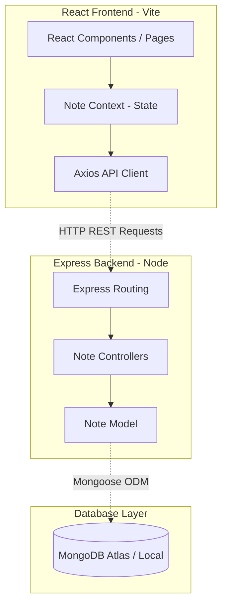

# NoteNest 📝

NoteNest is a responsive, full-stack note-taking application built using the modern **MERN stack** (MongoDB, Express, React, Node.js). Engineered with a clean architecture, it features a React 19 frontend stylized with Tailwind CSS v4, managed globally via the React Context API, and backed by a robust Express REST API.

---

## 🚀 Key Features

- **Intuitive CRUD Operations:** Create, read, update, and delete notes instantly with automatic, reactive state updates.
- **Dynamic Dark-Themed UI:** A fully responsive, modern dashboard crafted with Tailwind CSS v4 and Lucide icons.
- **Context-Driven State Management:** Lightweight global state handling using the React Context API, preventing component drilling and Redux overhead.
- **Robust Persistence:** MongoDB document store integration with pre-trimmed field validators and automated audit timestamps (`createdAt`, `updatedAt`).
- **High-Performance Development:** Powered by Vite for lightning-fast bundling, and linted with Oxlint for exceptional code quality checks.

---

## 🛠️ Tech Stack

### Frontend
- **Framework:** React 19 (Functional Components & Hooks)
- **Routing:** React Router DOM v7
- **Styling:** Tailwind CSS v4 (native Vite compiler integration)
- **API Client:** Axios
- **Icons:** Lucide React

### Backend
- **Runtime:** Node.js
- **Framework:** Express.js (v5)
- **Database ODM:** Mongoose (MongoDB)
- **Process Manager:** Nodemon
- **Security & Config:** CORS, Dotenv

---

## 📐 System Architecture

The application is structured around a decoupled client-server architecture:



---

## 📡 API Reference

All backend API routes are prefixed with `/api/v1/notesapp`.

| Method | Endpoint | Description | Request Body Schema |
| :--- | :--- | :--- | :--- |
| **GET** | `/get-AllNotes` | Retrieve all notes sorted newest first | *None* |
| **POST** | `/create-note` | Create a new note | `{ "title": "String", "content": "String" }` |
| **PUT** | `/update-note/:id` | Update title or content of an existing note | `{ "title": "String", "content": "String" }` |
| **DELETE** | `/delete-note/:id` | Remove a note permanently | *None* |

---

## 📂 Project Structure

```text
NoteNest/
├── backend/
│   ├── controllers/      # Route handler logic & controller functions
│   │   └── note.controller.js
│   ├── models/           # Mongoose schemas & Mongo database models
│   │   └── note.model.js
│   ├── routes/           # Express router endpoints mapping
│   │   └── note.route.js
│   ├── index.js          # Express server entry point & middleware configurations
│   ├── package.json
│   └── .env
└── frontend/
    ├── src/
    │   ├── api/          # Axios instance configured with backend URL
    │   │   └── url.js
    │   ├── components/   # Reusable presentation & layout components
    │   │   ├── Footer.jsx
    │   │   ├── Navbar.jsx
    │   │   ├── NoteCard.jsx
    │   │   └── NoteForm.jsx
    │   ├── context/      # State management context providers
    │   │   └── NoteContext.jsx
    │   ├── pages/        # Main application page components
    │   │   ├── Createnote.jsx
    │   │   └── Home.jsx
    │   ├── index.css     # Global styles and Tailwind imports
    │   ├── Layout.jsx    # React Router app layout wrapper
    │   └── main.jsx      # React mounting & router configuration
    ├── index.html
    ├── vite.config.js    # Vite config with Tailwind CSS v4 compiler plugin
    └── package.json
```

---

## ⚙️ Getting Started

### Prerequisites
- [Node.js](https://nodejs.org/) (v18.x or higher recommended)
- [MongoDB](https://www.mongodb.com/) (Local instance or MongoDB Atlas Cloud URI)

### Step 1: Clone and Install Dependencies

```bash
# Clone the repository
git clone https://github.com/yourusername/NoteNest.git
cd NoteNest

# Install backend dependencies
cd backend
npm install

# Install frontend dependencies
cd ../frontend
npm install
```

### Step 2: Configure Environment Variables

Create a `.env` file in the `/backend` directory:

```env
PORT=4001
MONGO_URL=your_mongodb_connection_uri
```

### Step 3: Run the Application

#### Start the Backend Server:
```bash
cd backend
npm start
```
*The server will run on `http://localhost:4001` (or whichever port is defined in `.env`).*

#### Start the Frontend Development Server:
```bash
cd frontend
npm run dev
```
*The Vite client will boot up (typically at `http://localhost:5173`).*

---

## 🧠 Engineering Decisions & Best Practices

- **Separation of Concerns (SoC):** Backend code is strictly modularized into controllers, models, and routes, making it highly testable and maintainable for future enhancements (e.g., adding user authentication).
- **React Context API for State:** Avoided complex state libraries (like Redux or Zustand) because the app's state requirements are lightweight. React Context provides optimal performance with minimal bundle overhead.
- **Fast Build Times & DX:** Configured Vite along with Oxlint to guarantee instant Hot Module Replacement (HMR) and sub-millisecond static code linting.
- **Robust Data Constraints:** Schema attributes use standard Mongoose trimming validators to ensure data integrity and avoid database pollution with empty strings.
