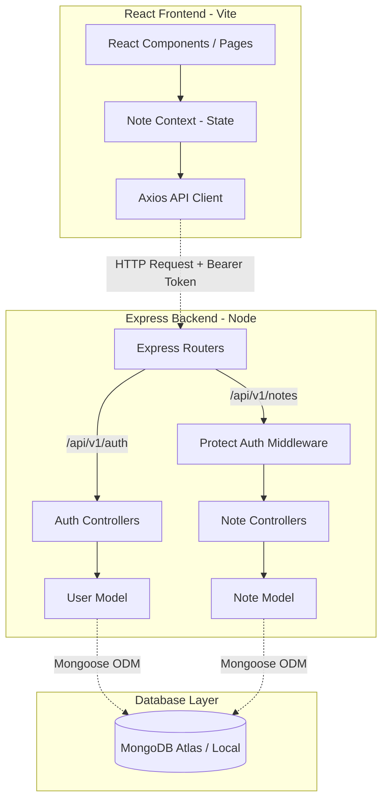

# NoteNest 📝

NoteNest is a responsive, full-stack note-taking application built using the modern **MERN stack** (MongoDB, Express, React, Node.js). Engineered with a clean architecture, it features a React 19 frontend stylized with Tailwind CSS v4, managed globally via the React Context API, and backed by a secure Express REST API with JWT authentication and RBAC-ready middleware protection.

---

## 🚀 Key Features

- **JWT Authentication & Authorization:** Secure user registration, login, logout, and token rotation using short-lived JWT Access Tokens and HttpOnly Refresh Token cookies.
- **Protected Endpoints:** Middleware-enforced authorization ensures user data privacy across all note operations.
- **Intuitive CRUD Operations:** Create, read, update, and delete notes instantly with automatic, reactive state updates.
- **Dynamic Dark-Themed UI:** A fully responsive, modern dashboard crafted with Tailwind CSS v4 and Lucide icons.
- **Context-Driven State Management:** Lightweight global state handling using the React Context API, preventing prop drilling and Redux overhead.
- **Robust Persistence:** MongoDB document store integration with pre-trimmed field validators, hashed passwords (bcrypt), and automated audit timestamps (`createdAt`, `updatedAt`).
- **High-Performance Development:** Powered by Vite for lightning-fast bundling, and linted with Oxlint for code quality checks.

---

## 🛠️ Tech Stack

### Frontend
- **Framework:** React 19 (Functional Components & Hooks)
- **Routing:** React Router DOM v7
- **Styling:** Tailwind CSS v4 (native Vite compiler integration)
- **API Client:** Axios (configured with base URL and credentials)
- **Icons:** Lucide React

### Backend
- **Runtime:** Node.js
- **Framework:** Express.js (v5)
- **Database ODM:** Mongoose (MongoDB)
- **Authentication & Security:** JSON Web Tokens (`jsonwebtoken`), Password Hashing (`bcryptjs`), Cookie Parser (`cookie-parser`), CORS
- **Process Manager:** Nodemon
- **Config:** Dotenv

---

## 📐 System Architecture

The application is structured around a decoupled client-server architecture with secure token authentication:



---

## 📡 API Reference

### 🔐 Auth Endpoints (`/api/v1/auth`)

| Method | Endpoint | Description | Request Body | Response |
| :--- | :--- | :--- | :--- | :--- |
| **POST** | `/register` | Register a new user | `{ "name": "...", "email": "...", "password": "..." }` | `accessToken`, `user` object, sets `refreshToken` cookie |
| **POST** | `/login` | Authenticate user & issue tokens | `{ "email": "...", "password": "..." }` | `accessToken`, `user` object, sets `refreshToken` cookie |
| **POST** | `/refresh-token` | Obtain new access token via refresh cookie | *HttpOnly Cookie* | `{ "accessToken": "..." }` |
| **POST** | `/logout` | Log out user and clear refresh cookie | *HttpOnly Cookie* | `{ "message": "User logged out successfully" }` |

### 📝 Notes Endpoints (`/api/v1/notes`) — *Protected*

> 🔒 **Header Required:** `Authorization: Bearer <accessToken>`

| Method | Endpoint | Description | Request Body Schema |
| :--- | :--- | :--- | :--- |
| **GET** | `/get-AllNotes` | Retrieve all notes | *None* |
| **POST** | `/create-note` | Create a new note | `{ "title": "String", "content": "String" }` |
| **PUT** | `/update-note/:id` | Update title or content of an existing note | `{ "title": "String", "content": "String" }` |
| **DELETE** | `/delete-note/:id` | Remove a note permanently | *None* |

---

## 📂 Project Structure

```text
NoteNest/
├── backend/
│   ├── src/
│   │   ├── config/       # Database connection setup
│   │   │   └── db.js
│   │   ├── controllers/  # Request handler logic
│   │   │   ├── auth.controller.js
│   │   │   └── note.controller.js
│   │   ├── middlewares/  # Express middlewares (JWT Auth protection)
│   │   │   └── auth.middleware.js
│   │   ├── models/       # Mongoose schemas (User & Note)
│   │   │   ├── note.model.js
│   │   │   └── user.model.js
│   │   ├── routes/       # Express route definitions
│   │   │   ├── auth.route.js
│   │   │   └── note.route.js
│   │   └── app.js        # Express app initialization & route mounting
│   ├── server.js         # Entry point & HTTP server listener
│   ├── package.json
│   ├── .env.example
│   └── .env
└── frontend/
    ├── src/
    │   ├── api/          # Axios instance configured with backend URL
    │   │   └── url.js
    │   ├── components/   # Reusable components (Navbar, NoteCard, NoteForm, Footer)
    │   │   ├── Footer.jsx
    │   │   ├── Navbar.jsx
    │   │   ├── NoteCard.jsx
    │   │   └── NoteForm.jsx
    │   ├── context/      # React Context state management
    │   │   └── NoteContext.jsx
    │   ├── pages/        # Main application pages
    │   │   ├── Createnote.jsx
    │   │   └── Home.jsx
    │   ├── index.css     # Global styles & Tailwind imports
    │   ├── Layout.jsx    # React Router app layout wrapper
    │   └── main.jsx      # React entry point & routing setup
    ├── index.html
    ├── vite.config.js    # Vite configuration
    └── package.json
```

---

## ⚙️ Getting Started

### Prerequisites
- [Node.js](https://nodejs.org/) (v18.x or higher recommended)
- [MongoDB](https://www.mongodb.com/) (Local instance or MongoDB Atlas Cloud URI)

### Step 1: Clone and Install Dependencies

```bash
# Clone the repository
git clone https://github.com/yourusername/NoteNest.git
cd NoteNest

# Install backend dependencies
cd backend
npm install

# Install frontend dependencies
cd ../frontend
npm install
```

### Step 2: Configure Environment Variables

Create a `.env` file in the `/backend` directory based on `.env.example`:

```env
PORT=4001
MONGO_URI=mongodb+srv://<username>:<password>@cluster0.example.mongodb.net/notenest
FRONTEND_URL=http://localhost:5173
JWT_ACCESS_SECRET=your_jwt_access_secret_here
JWT_REFRESH_SECRET=your_jwt_refresh_secret_here
NODE_ENV=development
```

### Step 3: Run the Application

#### Start the Backend Server:
```bash
cd backend
npm start
```
*The server will run on `http://localhost:4001`.*

#### Start the Frontend Development Server:
```bash
cd frontend
npm run dev
```
*The Vite client will boot up at `http://localhost:5173`.*

---

## 🧠 Engineering Decisions & Best Practices

- **Dual-Token Authentication Flow:** Access tokens expire quickly (15 mins) for minimal risk exposure, while refresh tokens (7 days) are stored in HttpOnly, SameSite cookies to protect against XSS attacks.
- **Separation of Concerns (SoC):** Clean layered architecture split across routes, middlewares, controllers, models, and database configurations.
- **Middleware Authorization:** Route protection is decoupled into a reusable Express middleware (`protect`), verifying signatures before reaching controller handlers.
- **React Context API for State:** Lightweight global state handling without unnecessary boilerplate libraries, tailored specifically for note state operations.
- **Fast Build Times & DX:** Configured Vite along with Oxlint to guarantee instant Hot Module Replacement (HMR) and sub-millisecond static code linting.
